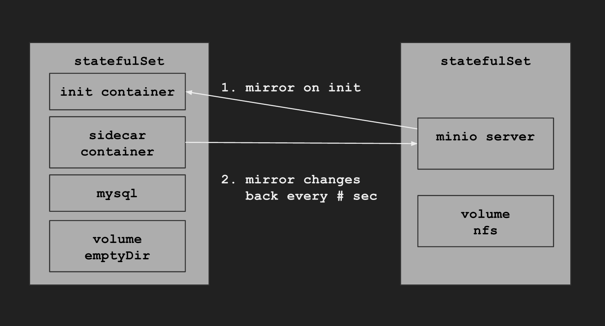

# volumizr

[](https://travis-ci.org/TheNatureOfSoftware/volumizr)

This is a simple (simplistic or poor but not necessarily bad) solution for solving storage in a Kubernetes cluster. The solution uses `emptyDir` volumes in `StatefulSet` and `init-containers` for setting up volumes before start by mirroring from a [Minio](https://minio.io) server, and after start continuously mirrors changes back.



## Usage

### Mirror in

Docker:
```
$ docker run --rm -it -v $PWD/config.json:/app/config/config.json -v $PWD/mydata:/app/target thenatureofsoftware/volumizr in minio/bucket1 /app/target
```

Init container in Kubernetes:
```
annotations:
  pod.beta.kubernetes.io/init-containers:
    '[{
    "name": "volumizr-in",
    "image": "thenatureofsoftware/volumizr:latest",
    "args": ["in", "minio/mysql", "/var/lib/mysql"],
    "volumeMounts": [{
      "mountPath": "/var/lib/mysql",
      "name": "persistentdata"
    }]
  }]
```

### Mirror out

For continuously mirror changes back to minio server.

Docker:
```
$ docker run --rm -it -v $PWD/config.json:/app/config/config.json -v $PWD/mydata:/app/source thenatureofsoftware/volumizr out /app/source minio/bucket1
```

As a sidecar container in Kubernetes:
```
...
- image: thenatureofsoftware/volumizr:latest
  imagePullPolicy: Always
  name: volumizr-out
  args:
  - out
  - /var/lib/mysql
  - minio/mysql
  volumeMounts:
  - mountPath: "/var/lib/mysql"
    name: persistentdata
...
```
